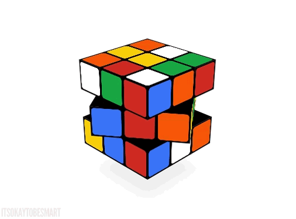

<h1 align="center"> Hi 👋, I'm Yashashree Chandak  </h1>
    
<h3 align="center"> A ML enthusiast, loves to solve maths problems!<  width="50" height="50"/></h3>

- 🔭 I’m currently **a Computer Science undergrad at PICT**

- 😄 Pronouns **She/Her**

- 🌱 I’m currently **learning NLP, exploring various datasets to apply my ML,DL knowledge**

- 💬 Ask me about **coding and mathematics**

- ⚡ Fun fact **: I love dancing (I'm a Kathak dancer)💃🏻, painting🎨, play chess occasionally♟️, singing🎼!**

<h3 align="left">Connect with me:</h3>

<h3 align="left">Languages and Tools:</h3>

           

  
 
 

